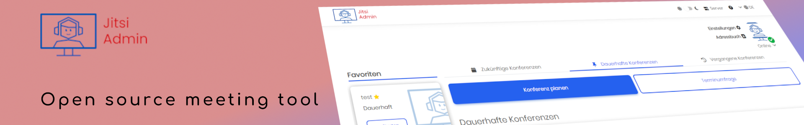
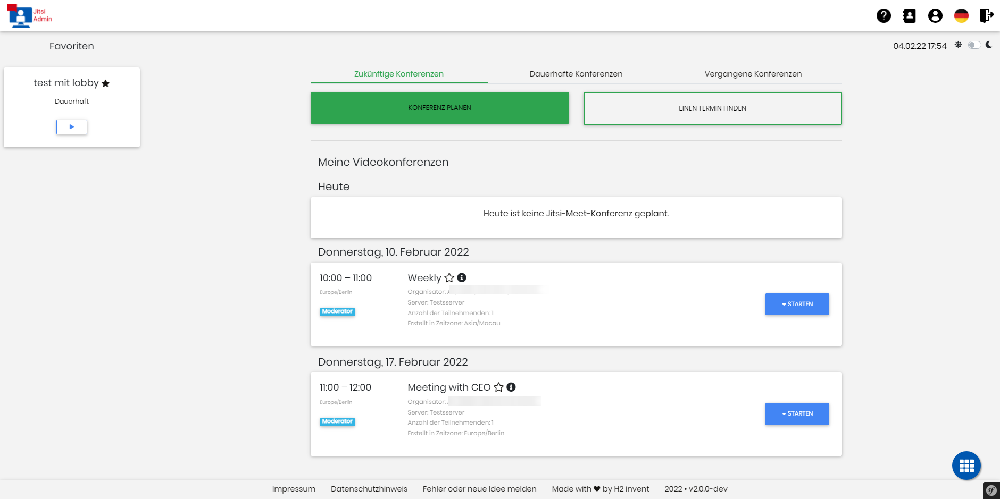
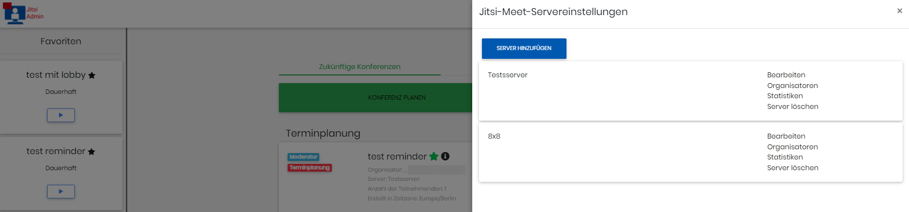
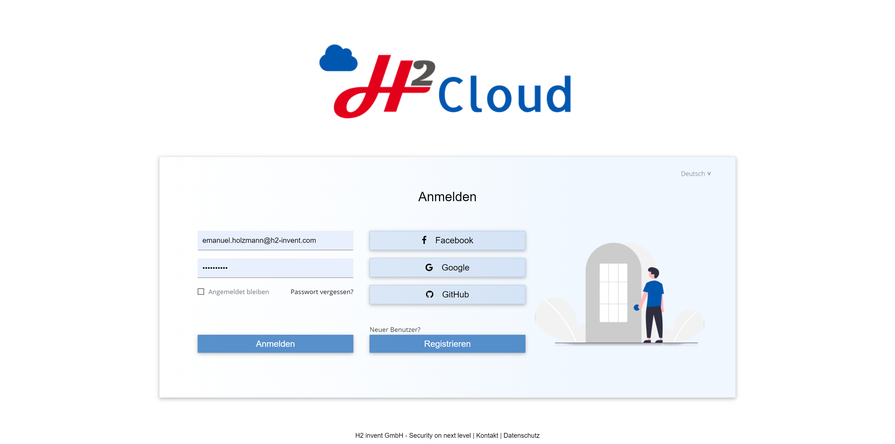
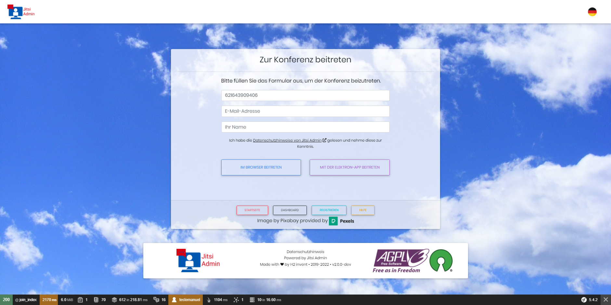
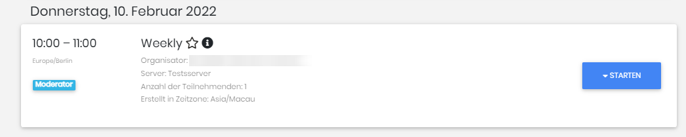

[deutsch](README_de.md)


# Jitsi Manager

[](code_of_conduct.md)
[](https://crowdin.com/project/jitsi-admin)


Jitsi Manager, also known as Jitsi Admin, is a powerful tool designed to manage Jitsi conferences and servers effectively. This README provides an overview of its features and functionalities.

## Introduction

Jitsi Manager offers a comprehensive solution for organizing and securing your conferences, ensuring a seamless communication experience for all participants. Whether you prefer to use JSON Web Tokens (JWT) for enhanced security or opt for a simpler setup without JWT, Jitsi Manager has got you covered. It provides robust protection against conference bombing attacks, giving you peace of mind during your meetings.

## Key Features

Jitsi Manager boasts a range of features to streamline your conference management tasks. Some of the key functionalities include:

* **Organize Meetings and Manage Participants**: Easily create and manage meetings, allowing you to control participant access and privileges effectively.

* **Series Appointments**: Schedule recurring meetings, enabling you to set up regular conferences without manual intervention.

* **Appointment Polls**: Create polls to gather availability information from participants and find the best time for your meetings.

* **Adressbook Integration**: Organize your participants efficiently by integrating them into your address book or contact management system.

* **Direct Calls**: Make direct calls using your Jitsi Meet backend, facilitating one-on-one communication with participants.

* **LDAP or SSO Integration**: Seamlessly integrate Jitsi Admin with your existing LDAP or Single Sign-On (SSO) infrastructure, simplifying user management and authentication.

* **Outlook Integration**: Import all your conferences into Outlook using iCal Link, ensuring synchronization between Jitsi Manager and your calendar.

* **Meeting Reminders**: Send email reminders to participants before each meeting, helping them stay informed and prepared.

* **Webinars and Open Conferences**: Create webinars and other open conferences, allowing for broader participation and engagement.

* **Additional Great Features**: Jitsi Manager includes many more powerful features that you would typically find in leading conference tools, providing a comprehensive solution for your needs.

### Known from


### Mailing list and contact

To directly chat with the community join our matrix group

__#jitsi-admin:h2-invent.com__


[Join the matrix grop via matrix.to](https://matrix.to/#/#jitsi-admin:h2-invent.com)


Furthermore, we are excited to announce that we will be hosting an open conference every two weeks, where you can join us to discuss how we can make Jitsi and Jitsi-admin even more popular.
We welcome your ideas and suggestions to enhance the project and encourage you to be a part of this exciting initiative. The community talk takes place every even Thursday at 06:00pm

To join the community talk, please click on the subscription link provided: http://jitsi-admin.de/subscribe/self/4754e33d3ee9a6c40a2bf04ffa1528c7

Once you have subscribed, we will send you a reminder closer to the date of the talk. We hope to see you there!


If you want to be notified, if there are new updates or releases, you can subscribe to the __Jitsi Admin Update__ mailing list.
H2 invent will send out information to the mailing list concering releases, updates or new features.
This is __not__ a marketing newsletter.

If you want to join the mailing list just click on the link [Mailing List](https://verteiler.h2-invent.com/?p=subscribe&id=1) and enter your email address.
We use a double-opt-in process where you will receive a confirmation email containing a link with with you confirm, that you want to join to mailing list.

It is always possible to leave the mailing list.

### Partners and Sponsors
<br>
We cooperate with the city administrations of Baden-Baden, Bretten, Bruchsal, Bühl, Ettlingen, Gaggenau, Rastatt, Rheinstetten and Stutensee

## Docker installation
follow the instruction at [Dockerinstruction](installDocker.md)

## Translation
Please help us to improve our localization

[](https://crowdin.com/project/jitsi-admin)
# Features

The following features are already part of Jitsi Admin:

* Complete 

### The Dashboard

The Dashboard is the central view where all information to all conferences is displayed


### The Servers

All servers can be managed centrally and different permissions can be configured.
Multiple Jitsi Servers can be combined to one setup and managed accordingly


### Login

The login uses a SSO Server, e.g. Keycloak or other Identidy Providers


### Join of the conference

Guests are able to join a conference through a link received via email __without__ having a user account in Jitsi Manager.
There is a page for joining where the conference ID, the email address and the name are entered.
After that a JWT will be generated and the guest is able to join the conference.


Users with a user account are able to join conferences directly via Jitsi Manager, either by using the web page or the Jitsi Electron Desktop App.


More information can be found at https://jitsi-admin.de

# Getting Started

As some Composer dependencies need to be installed, it is advised to only install Jitsi Manager if you have shell access to you server.

* [Getting Started ](https://github.com/H2-invent/jitsi-admin/wiki/Get-Started-English)
* [Minimum Requirements](https://github.com/H2-invent/jitsi-admin/wiki/Minimum-server-requirements-English)
* [API Documentation (in German)](https://github.com/H2-invent/jitsi-admin/wiki/API-Endpoints)

# License

Currently Jitsi Admin is released under the [AGPL-3.0 License](https://www.gnu.org/licenses/agpl-3.0.en.html). Additional information can be found in the [LICENSE file](LICENSE).

# Installation
Download the version you want to install or clone the whole repository.
After that execute the following command
```bash
bash install.sh
```
Follow the instruction in the command window.

# Update
Follow the corresponding update instruction.

For versions <= 0.72x checkout the update instruction in the github version description.

For Version 0.73 or later the update instruction is described in the file 
`update_instruction_<fromVersion>...<toVersion>.md`

[Update instruction 0.75.x to 0.76.x](update_instruction_0.75.x...0.76.x.md)
[Update instruction 0.74.x to 0.75.x](update_instruction_0.74.x...0.75.x.md)
[Update instruction 0.73.x to 0.74.x](update_instruction_0.73.x...0.74.x.md)
[Update instruction 0.72.x to 0.73.x](update_instruction_0.72.x...0.73.x.md)

