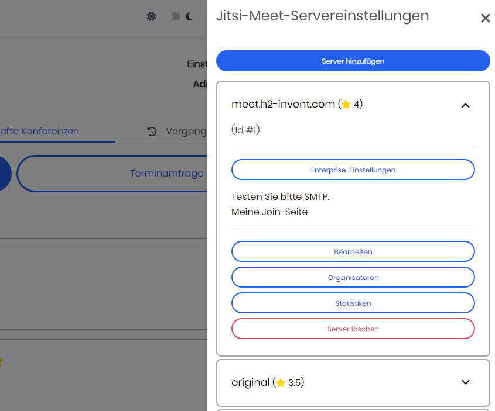
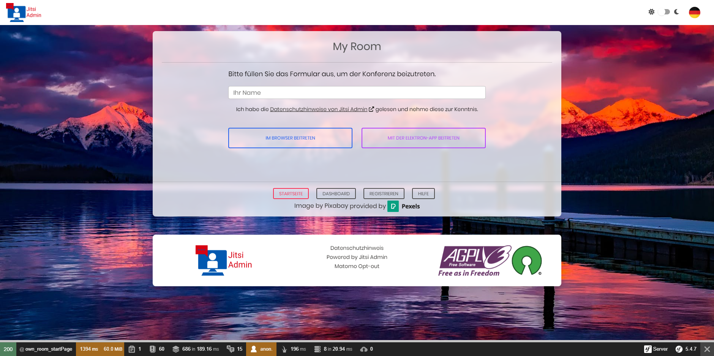

[deutsch](README_de.md)

  

 

<h1 align="center">Jitsi Admin</h1>

  
  
  

<h2>Overview</h2>

<strong>Jitsi Admin</strong> (formerly Jitsi Manager) is a central administration platform
for operating <strong>Jitsi</strong> and <strong>Livekit</strong> based video conferencing infrastructures.

The platform focuses on <strong>control, security and scalability</strong>.
It is built for organizations that want predictable behavior instead of ad-hoc meetings
and unmanaged conference links.

<h2>Architecture</h2>

<ul>
  <li><strong>Frontend:</strong> Purpose-built UI, optimized for daily administrative workflows</li>
  <li><strong>Backend:</strong> Conference lifecycle management, scheduling, JWT handling</li>
  <li><strong>Media Layer:</strong>
    <ul>
      <li>Jitsi (classic deployments)</li>
      <li><strong>Livekit</strong> (recommended for performance and stability)</li>
    </ul>
  </li>
</ul>

Authentication can be operated with or without JWTs.
Running public conferences without protection will result in abuse. That is not a bug.

<h2>Key Features</h2>

<table>
  <tr>
    <td><strong>Media</strong></td>
    <td>
      Livekit integration · Jitsi support · Low latency WebRTC · Direct calls · Webinars
    </td>
  </tr>
  <tr>
    <td><strong>Scheduling</strong></td>
    <td>
      Series appointments · Polls · Outlook / iCal · Calendly integration
    </td>
  </tr>
  <tr>
    <td><strong>Identity</strong></td>
    <td>
      LDAP · SSO (Keycloak etc.) · Guest access via JWT
    </td>
  </tr>
  <tr>
    <td><strong>Tooling</strong></td>
    <td>
      Chrome Extension:
      <a href="https://chromewebstore.google.com/detail/meetling-sofortkonferenz/eigjajmppcgpcghajhmbddidmdfeepce">
        Meetling
      </a>
    </td>
  </tr>
</table>

<h2>Installation</h2>

Jitsi Admin requires shell access and basic Docker or Kubernetes knowledge.
This is infrastructure software, not a hosted SaaS click-install.

<h3>Docker</h3>

Recommended for small to medium installations.

👉 <a href="installDocker.md">Docker installation instructions</a>

<h3>Kubernetes / Helm</h3>

Recommended for production and high availability setups.

👉 <a href="https://reg.h2-invent.com/harbor/projects/16/repositories/meetling/artifacts-tab">
Helm Chart Repository
</a>

<h2>Livekit Evaluation</h2>

<ol>
  <li>Install Livekit</li>
  <li>Configure it via the Jitsi Admin UI</li>
  <li>Run a conference</li>
</ol>

The difference in latency and media quality compared to classic Jitsi is obvious.

<h2>User Interface</h2>

<h3>Dashboard</h3>

Central overview of conferences and system state.

<h3>Server Management</h3>

Multiple Jitsi servers combined into one logical setup.

<h3>Authentication</h3>

SSO based login via Keycloak or compatible providers.

<h3>Conference Join</h3>

<strong>Guests:</strong> Join via email link, JWT is generated automatically.

<strong>Users:</strong> Join directly via web UI or Electron app.

<h2>Getting Started</h2>

<ul>
  <li><a href="https://github.com/H2-invent/jitsi-admin/wiki/Get-Started-English">Getting Started</a></li>
  <li><a href="https://github.com/H2-invent/jitsi-admin/wiki/Minimum-server-requirements-English">Minimum Requirements</a></li>
  <li><a href="https://github.com/H2-invent/jitsi-admin/wiki/API-Endpoints">API Documentation (German)</a></li>
</ul>

Project website: <a href="https://jitsi-admin.de">https://jitsi-admin.de</a>

<h2>Community</h2>

Matrix channel: 
<strong>#jitsi-admin:h2-invent.com</strong> 
<a href="https://matrix.to/#/#jitsi-admin:h2-invent.com">Join via matrix.to</a>

Community call every even Thursday at 18:00 (CEST).

<a href="http://jitsi-admin.de/subscribe/self/4754e33d3ee9a6c40a2bf04ffa1528c7">
Subscribe here
</a>

<h2>Mailing Lists</h2>

<a href="https://lists.h2-invent.com/forms/nfrm_weLJnLY5">Join mailing list</a> 
Technical updates only. No marketing. Double opt-in.

<h2>Partners & Sponsors</h2>

 
Core maintainer

 
Official SaaS solution

 
Public sector cooperation (Baden-Württemberg)

<h2>Support Policy</h2>

Jitsi Admin is free software.
Free individual support is not included.

Invalid issues and support requests will be closed.
This is intentional.

<h2>License</h2>

AGPL-3.0 
<a href="https://www.gnu.org/licenses/agpl-3.0.en.html">License text</a> ·
<a href="LICENSE">LICENSE file</a>

<h2>Customization</h2>

Use <code>.env.custom</code> for overrides. 
After changes run:

<pre><code>bash installDocker.sh</code></pre>

<code>docker-compose up</code> is not sufficient.

<h2>Updates</h2>

<ul>
  <li><a href="update_instruction_0.75.x...0.76.x.md">0.75.x → 0.76.x</a></li>
  <li><a href="update_instruction_0.74.x...0.75.x.md">0.74.x → 0.75.x</a></li>
  <li><a href="update_instruction_0.73.x...0.74.x.md">0.73.x → 0.74.x</a></li>
  <li><a href="update_instruction_0.72.x...0.73.x.md">0.72.x → 0.73.x</a></li>
</ul>
