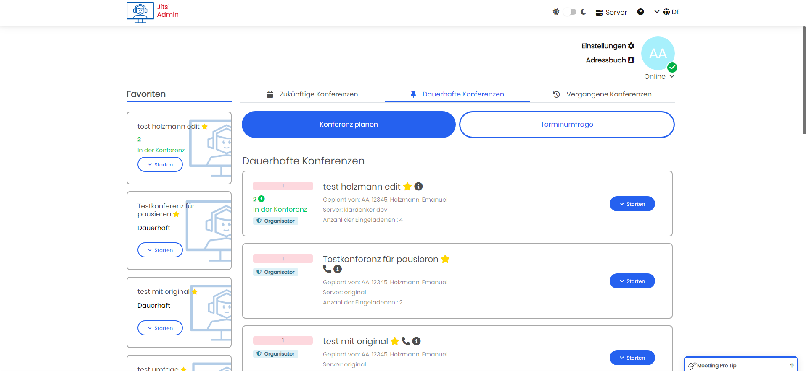

[deutsch](README_de.md)


# Jitsi Admin

[](code_of_conduct.md)
[](https://crowdin.com/project/jitsi-admin)
[](https://github.com/H2-invent/jitsi-admin/actions/workflows/pipeline-test.yml)


Jitsi Manager (or Jitsi Admin) is a powerful tool designed to manage Jitsi conferences and servers effectively. Now, with **Livekit integration**, you can experience a next-generation WebRTC server that provides unmatched quality and performance.

---

## Introduction

With the addition of **Livekit**, Jitsi Manager now offers an even more comprehensive solution for organizing and securing your video conferences. Livekit's performance far surpasses that of traditional WebRTC solutions, providing superior video and audio quality. We’ve also developed a new frontend tailored to Livekit, ensuring productivity-focused features while avoiding unnecessary complexity.

Whether you're using **JWT tokens** for secure authentication or setting up without them, Jitsi Manager ensures your conferences are safe from intrusions like conference bombing attacks. Manage everything centrally with our easy-to-use dashboard and enjoy seamless user experience with **LDAP/SSO integration** or direct guest access.

---

## Key Features

- **Livekit Integration**: Experience top-tier WebRTC server technology, providing unmatched video/audio quality and low-latency communication.
- **Organize and Manage Conferences**: Control participant access, privileges, and conference settings with ease.
- **Series Appointments & Polls**: Schedule recurring meetings and gather availability with appointment polls.
- **LDAP or SSO Integration**: Simplify user authentication by connecting Jitsi Admin to your existing LDAP or SSO setup.
- **Direct Calls**: Enable one-on-one communication directly through Jitsi.
- **Outlook Integration**: Synchronize your meetings with Outlook via iCal links.
- **Webinars and Open Conferences**: Host larger webinars and open meetings effortlessly.
- **Meeting Reminders**: Keep participants informed with automated email reminders.

---

## Testing Livekit Integration

To test Livekit integration:
1. Install Livekit with a single line of code.
2. Set up your Livekit server through the Jitsi Admin dashboard.

You’ll experience the new level of performance and see how easily Livekit integrates with Jitsi Manager.

---
### Known from


### Mailing list and contact

To directly chat with the community join our matrix group

__#jitsi-admin:h2-invent.com__


[Join the matrix grop via matrix.to](https://matrix.to/#/#jitsi-admin:h2-invent.com)


Furthermore, we are excited to announce that we will be hosting an open conference every two weeks, where you can join us to discuss how we can make Jitsi and Jitsi-admin even more popular.
We welcome your ideas and suggestions to enhance the project and encourage you to be a part of this exciting initiative. The community talk takes place every even Thursday at 06:00pm

To join the community talk, please click on the subscription link provided: http://jitsi-admin.de/subscribe/self/4754e33d3ee9a6c40a2bf04ffa1528c7

Once you have subscribed, we will send you a reminder closer to the date of the talk. We hope to see you there!


If you want to be notified, if there are new updates or releases, you can subscribe to the __Jitsi Admin Update__ mailing list.
H2 invent will send out information to the mailing list concering releases, updates or new features.
This is __not__ a marketing newsletter.

If you want to join the mailing list just click on the link [Mailing List](https://verteiler.h2-invent.com/?p=subscribe&id=1) and enter your email address.
We use a double-opt-in process where you will receive a confirmation email containing a link with with you confirm, that you want to join to mailing list.

It is always possible to leave the mailing list.

### Partners and Sponsors
<br>
H2 invent develops as maintainer the jitsi admin

<br>
meetling is the official SAAS solution for the jitsi admin for professionals

<br>
We cooperate with the city administrations of Baden-Baden, Bretten, Bruchsal, Bühl, Ettlingen, Gaggenau, Rastatt, Rheinstetten and Stutensee

## Docker installation
follow the instruction at [Dockerinstruction](installDocker.md)

## Translation
Please help us to improve our localization

[](https://crowdin.com/project/jitsi-admin)
# Features

The following features are already part of Jitsi Admin:

* Complete 

### The Dashboard

The Dashboard is the central view where all information to all conferences is displayed


### The Servers

All servers can be managed centrally and different permissions can be configured.
Multiple Jitsi Servers can be combined to one setup and managed accordingly


### Login

The login uses a SSO Server, e.g. Keycloak or other Identidy Providers


### Join of the conference

Guests are able to join a conference through a link received via email __without__ having a user account in Jitsi Manager.
There is a page for joining where the conference ID, the email address and the name are entered.
After that a JWT will be generated and the guest is able to join the conference.


Users with a user account are able to join conferences directly via Jitsi Manager, either by using the web page or the Jitsi Electron Desktop App.


More information can be found at https://jitsi-admin.de

# Getting Started

As some Composer dependencies need to be installed, it is advised to only install Jitsi Manager if you have shell access to you server.

* [Getting Started ](https://github.com/H2-invent/jitsi-admin/wiki/Get-Started-English)
* [Minimum Requirements](https://github.com/H2-invent/jitsi-admin/wiki/Minimum-server-requirements-English)
* [API Documentation (in German)](https://github.com/H2-invent/jitsi-admin/wiki/API-Endpoints)

# Support policy
You can use the jitsi-admin for free, respecting the obligations of the Open Source license, but please do not ask or expect free support as well.
Use discussions to ask questions and get support from the community.
If you report an invalid issue and/or ask for step-by-step support, your issue will be closed as invalid without further explanation and/or the "support request" label will be added. Invalid bug reports may confuse other users. Thanks for understanding.


# License

Currently Jitsi Admin is released under the [AGPL-3.0 License](https://www.gnu.org/licenses/agpl-3.0.en.html). Additional information can be found in the [LICENSE file](LICENSE).

# Installation
Download the version you want to install or clone the whole repository.
After that execute the following command
for Debian:
```bash
bash installDockerDebian.sh
```
for Ubuntu
```bash
bash installDockerUbuntu.sh
```
Follow the instruction in the command window.
## Customize your installation
To customize the environment variable in your installation please set the environments in the `.env.custom` file.
You can copy/past the variable you want to change from `.env` into the `.env.custom`.
After changing the `.env.custom` file you have to rerun `bash installDocker.sh` command to restart the container. `docker-compose up` is not enough


# Update
Follow the corresponding update instruction.
    
For versions <= 0.72x checkout the update instruction in the github version description.

For Version 0.73 or later the update instruction is described in the file 
`update_instruction_<fromVersion>...<toVersion>.md`

[Update instruction 0.75.x to 0.76.x](update_instruction_0.75.x...0.76.x.md)
[Update instruction 0.74.x to 0.75.x](update_instruction_0.74.x...0.75.x.md)
[Update instruction 0.73.x to 0.74.x](update_instruction_0.73.x...0.74.x.md)
[Update instruction 0.72.x to 0.73.x](update_instruction_0.72.x...0.73.x.md)

