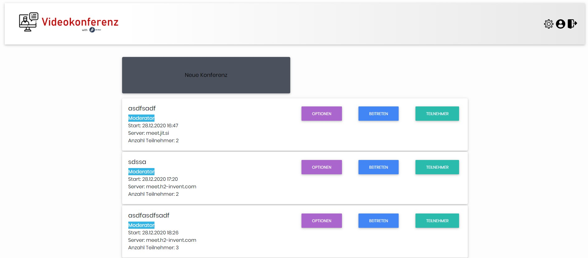
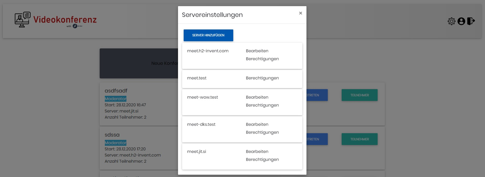
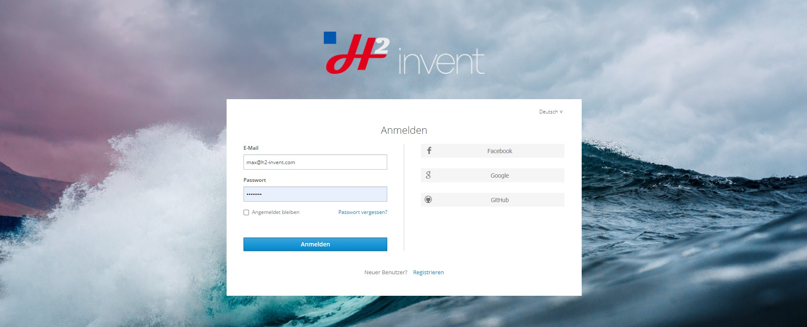
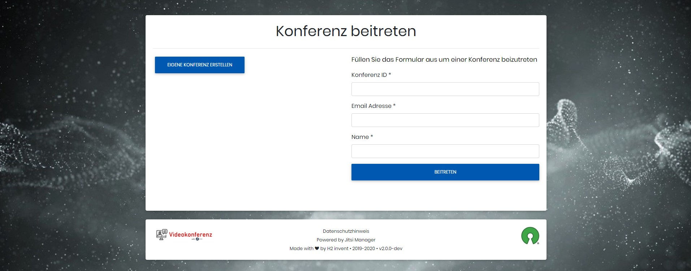
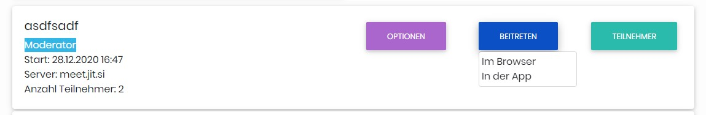

[english](README.md)


# Jitsi Manager

[](code_of_conduct.md)
[](https://crowdin.com/project/jitsi-admin)

Jitsi Manager oder Jitsi Admin zum Verwalten von Jitsi Konferenzen und Server mit JWT

### Bekannt aus


## Docker Installation
Folge der Anleitung [Dockeranweisung](installDocker.md)

### Verteilerliste

Sie können sich in unsere Verteilerliste __Jitsi Admin Update__ eintragen damit Sie bei einem Update oder neuen Release
informiert werden. H2 invent verschickt über diese Verteilerliste nur Informationen zu Releases, Updates und neuen
Features. Es handelt sich hierbei __nicht__ um einen Marketing-Newsletter. Wir verschicken die Email nur in englischer
und nicht in deutscher Sprache.

Zum Eintragen in den Verteiler klicken Sie auf den
Link [Verteilerliste](https://verteiler.h2-invent.com/?p=subscribe&id=1) und geben dort Ihre E-Mail-Adresse ein. Wir verwenden
ein Doppel-Opt-in Verfahren. Sie erhalten daher eine Bestätigungsemail mit einem Link auf den Sie einmal klicken müssen
um die Eintragung in der Verteilerliste zu bestätigen.

Sie können sich jederzeit aus der Verteilerliste austragen.

### Partner und Sponsoren
<div style="text-align: center">


<br>
Interkommunale Zusammenarbeit der Städte Baden-Baden, Bretten, Bruchsal, Bühl, Ettlingen, Gaggenau, Rastatt, Rheinstetten und Stutensee
</div>

## Übersetzungen
Wir suchen noch Hilfe für die Übersetzung der Software

[](https://crowdin.com/project/jitsi-admin)

# Funktionen

Folgende Funktionen sind bereits im Jitsi Administrator integriert:

* Verwalten von Konferenzen
* Verwalten von Jitsi Servern mit JWT Funktion
* Hinzufügen von Teilnehmern zu einer Konferenz
* Verschicken von Emails an die Teilnehmer
* Verschicken von Emails vor der Konferenz über einen CronJob
### Das Dashboard

Alle Informationen zu den Konferenzen stehen auf dem zentralen Dashboard


### Die Server

Alle Server können zentral verwaltet werden und unterschiedliche Berechtigungen verteilt werden. Es können mehre Jitsi
Server in einer Installation verwaltet werden.


### Login

Der Login erfolgt über einen SSO Server, z.B. Keycloak oder weitere Identidy Provider


### Join der Konferenz

Gäste können über einen Link in der Email der Konferenz beitreten __ohne__ einen Benutzer im Jitsi Manager zu haben. Den
Gästen steht eine Seite zum Beitreten bereit. Es wird nach der Konferenz ID, der E-Mail-Adresse und dem Namen gefragt.
Danach wird ein JWT erstellt mit dem der Gast der Konferenz beitreten kann.


Benutzer können direkt aus dem Jitsi Manager heraus der Konferenz beitreten, entweder über den Browser oder über die
Jitsi Electron Desktop App auf dem PC.


Mehr Informationen auf https://jitsi-admin.de

# Get Started

Auf Grund der Composer Abhängigkeiten wird ein Webspace für den Betrieb der Webanwendung nicht empfohlen. Enterprise
bedeutet, dass der Jitsi Admin als Manadatenlösung und interne Webanwendung betrieben werden kann. Die Verwaltung,
Updates und Wartung muss durch die Zuständige und Verantwortliche Person durchgeführt werden.

* [Anleitung im Wiki](https://github.com/H2-invent/jitsi-admin/wiki/Get-Started)
* [Mindestanforderungen](https://github.com/H2-invent/jitsi-admin/wiki/Mindestanforderungen-an-den-Server)
* [API Dokumentation](https://github.com/H2-invent/jitsi-admin/wiki/API-Endpoints)

# Lizenz

Die aktuelle Version von Jitsi Admin wird unter der AGPL-3.0 License bereitgestellt. Weitere Informationen finden Sie in
der LICENSE Datei in diesem Repo.

# Installieren
Laden Sie sich gewüschte Version herunter oder Klonen Sie das Repo.

Führen Sie danach folgenden Befehl in dem Ordner aus
```javascript
bash install.sh
```
geben Sie alle informationen während dem Installationsvorgang korrekt ein
# Update
Führen sie die nachfolgenden Update-Schritte aus

Für Versionen <= 0.72x lesen Sie die Update-Anleitungen direkt in der Github Version

Für Versionen 0.73 oder später, lesen Sie zugehörigen Update-Anleitungen
`update_instruction_<fromVersion>...<toVersion>.md`

[Update instruction 0.73.x to 0.74.x](update_instruction_0.73.x...0.74.x.md)
[Update instruction 0.72.x to 0.73.x](update_instruction_0.72.x...0.73.x.md)
