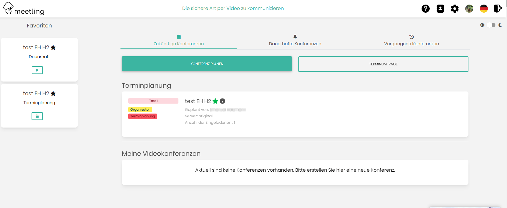

# Version 0.74.x ... 0.75.x

## Whats new
* Window in Window of conferences (Multiframing)
* Integrate any application you use in a frame and open it during the conference.
* Status view (online, offline, in a meeting)
* Whiteboard functionality
* New real websocket (replace Mercure Hub)
* New addressbook (Search, Index etc.)
* Send messages to waitung users in the Lobby
* Invite new participants directly from the conference
* New error pages
* Public Conference as you are used from original jitsi. Just type a name and share this link with your audience. But secured with a JWT.

### Update on OS
__Drop PHP7.4 support. Use PHP8.0 or better php8.1__

__Node ^16.15 and npm ^8.5 have to be installed__

1. Go into the directory where your jitsi-admin is installed e.g. `cd /var/www/html`
2. Install new jitsi-admin files `php compser.phar install`
3. Install new NPM packages `npm install`
4. __(Optional)__ Backup your database
5. Migrate Database to the latest version: `php bin/console doc:mig:mig`
6. Rebuild js and css `npm run build`
7. Clean cache `php bin/console cache:clear`
8. Set the permission `sudo chown -R www-data:www-data var/`
9. Check your email settings with the command `php bin/console app:email:test <serverId> <email@domain.de>`. You should receive a test email
10. Install the new websocket application:
    1. __We replace the mercure HUb because of connection issues__
    2. For detailed instruction follow [https://github.com/H2-invent/jitsi-admin/wiki/Websocket-installation](https://github.com/H2-invent/jitsi-admin/wiki/Websocket-installation)
    2. install node Version >16
       1. ````bash
          sudo apt update
          sudo apt upgrade
          sudo apt install -y curl
          curl -fsSL https://deb.nodesource.com/setup_16.x | sudo -E bash -
          sudo apt install -y nodejs
          node --version
          v16.1.0
          ````
    4. Change into the application directory `cd nodejs`
    5. install the websocket assets with `npm install`
    5. Start the websocket application `WEBSOCKET_SECRET=<SECRET_FROM_ENV> AWAY_TIME=<TIME_UNTIL_AUTOMATIC_AWAY_STATUS> PORT=3000 node .`
    6. Configure your reverse proxy to find the websocket.
11. To customize the jitsi-admin to follow your CI-guidelines contact [H2-Invent GmbH](mailto:info@h2-invent.com)
    1. Example:


### Update Docker installation from 0.72.x ... 0.73.x

1. Checkout latest Tag 
2. go into the jitsi-admin director e.g. `cd /var/jitsi-admin/`
3. Shutdown existing jitsi-admin installation `docker-compose down`
4. Start the Docker install Script `bash installDocker.sh`
5. All settings should be correct, just hit enter to confirm.
6. You have now two more worker container, doing async stuff
7. Database is automatically upgraded
8. To customize the jitsi-admin to follow your CI-guidelines contact [H2-Invent GmbH](mailto:info@h2-invent.com)
   1. Example:

