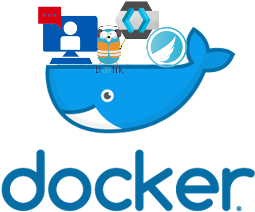
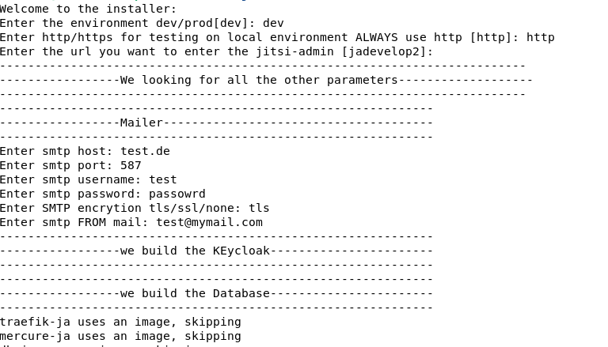
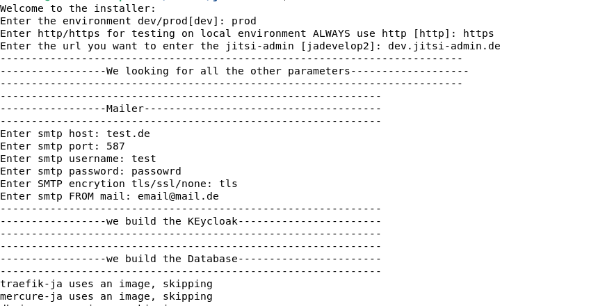

# Jitsi Manager

[](code_of_conduct.md)
[](https://crowdin.com/project/jitsi-admin)

Jitsi-Admin is now available as docker installation
## Why?
the jitsi-admin is getting bigger and bigger.
first we started just with an apache server. Then the keycloak came to make authentification easier. BUt the installation getting harder and harder.

Now we added mercure rocks hub to enable real time communication.
This all leads to a bigger complexity. To make the installation as easy as before, we created a new docker installer.


### Installation
Clone this repo in your directory.
We suggest to clone it into a persistant directory.

```
cd /var/www
git clone https://github.com/H2-invent/jitsi-admin.git
cd jitsi-admin
```
From here you can decide if you want to use the jitsi-admin only for local testing or if you want to run it with a real Domain.

**Important: The installation is not production ready. So you have to apply your own security rules**.

#### Install local Jitsi-admin
##### Prerequisites
* unused port 80
* Docker and docker compose installed
* sed installed
* Debian 10 or comparable

start the installer with
`bash installDocker.sh`
Now you are going to be asked for a lot informations.



* Enter here **dev** and **http**
* Then enter the local url you want to use to enter the application.
* Enter you SMTP credentials

Hin enter and wait. After some minutes just go to the browser and enter **http://<yourDomain>** and your jitsi-admin is up.

### Install with Letsencrypt
##### Prerequisites
* unused port 80 **and** 443
* Docker and docker compose installed
* sed installed
* Debian 10 or comparable

start the installer with
`bash installDocker.sh`
Now you are going to be asked for a lot informations.



* Enter here **prod** and **https**
* Then enter the  url you want to use to enter the application.
* Enter you SMTP credentials

Hin enter and wait.
After some minutes just go to the browser and enter **https://<yourDomain>** and your jitsi-admin is up.

### I want to visit and harden my keycloak

The keycloak is accessible from the domain: `http/s://keycloak.<yourDomain>`. 
Just klick on Admin console and then the username: **admin** and the password is saved in the file **docker.conf** in the Parameter: **KEYCLOAK_ADMIN_PW**
Here you can now set up you keycloak as wished.


### I want to visit the traefik Services:
Go to `http/s://traefik.<yourDomain>`.
Enter the credentials: test:test

