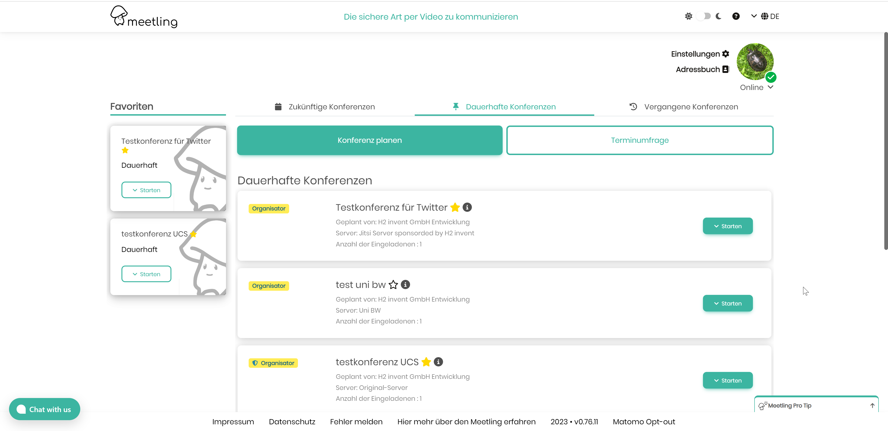

## Update Instruction for Version 0.73.x ... 0.74.x
__Drop PHP7.4 support. Use PHP8.0 or better php8.1__

__Node ^16.15 and npm ^8.5 have to be installed__

1. Go into the directory where your jitsi-admin is installed e.g. `cd /var/www/html`
2. Install new jitsi-admin files `php compser.phar install`
3. Install new NPM packages `npm install`
4. __(Optional)__ Backup your database
5. Migrate Database to the latest version: `php bin/console doc:mig:mig`
6. Rebuild js and css `npm run build`
7. Clean cache `php bin/console cache:clear`
8. Set the permission `sudo chown -R www-data:www-data var/`
9. Check your email settings with the command `php bin/console app:email:test <serverId> <email@domain.de>`. You should receive a test email
10. If you use profilePicture served from a local storage (default) then set the ENV-Variable in the .env.local file to VICH_BASE=>yourdomain<
11. To customize the jitsi-admin to follow your CI-guidelines contact [H2-Invent GmbH](mailto:info@h2-invent.com)
    1. Example:

### Update Docker installation from 0.73.x ... 0.74.x

1. Checkout latest Tag 
2. go into the jitsi-admin director e.g. `cd /var/jitsi-admin/`
3. Shutdown existing jitsi-admin installation `docker-compose down`
4. Start the Docker install Script `bash installDocker.sh`
5. All settings should be correct, just hit enter to confirm.
6. You have now two more worker container, doing async stuff
7. Database is automatically upgraded
8. To customize the jitsi-admin to follow your CI-guidelines contact [H2-Invent GmbH](mailto:info@h2-invent.com)
   1. Example: