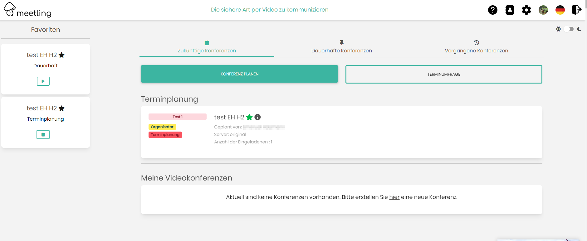

## Update Instruction for Version 0.76.x ... 0.77.x


## New Features:
- **Default End-to-End Encryption (E2E):** We are thrilled to introduce the ability to enable End-to-End Encryption by default for enhanced security and privacy. Now, each server can individually configure this feature, giving you control over the level of encryption applied to your communications.
- **Transparent Background for Videoconference Tags:** In response to your feedback, we've added a new feature that allows you to set tags in videoconferences with a transparent background. This ensures a more immersive videoconference experience by maximizing the display area, making your meetings more engaging and effective.
   - set `LAF_SHOW_TAG_TRANSPARENT_BACKGROUND=1` to show the tags in the conference with a transparent background
## Improvements:
nothing here
## Bugs:
nothing here

# Update
__Drop PHP8.0 support. Use PHP8.1 or better php8.2__
__The installer is now using nginx so please remove Apache when you use it__

__Node ^18.0 and npm ^9.5 have to be installed__

__Prequrequesits for the installer: jitsi-admin is installed in /var/www/jitsi-admin__
If not then copy your old `.env.local` file into `/var/www/jitsi-admin` to save your existing settings

1. 
```bash
cd ~
wget https://github.com/H2-invent/jitsi-admin/raw/master/install.sh
sudo bash install.sh
```
2. Start the Updater with `sudo bash install.sh` and follow the steps
3. If you want to use the whiteboard or/and etherpad integration set the paramter in the .env.local file
```
### WHITEBOARD If you want to integrate Whitebophir (https://github.com/lovasoa/whitebophir)
LAF_WHITEBOARD_FUNCTION=1
WHITEBOARD_URL=https://wbo.domain.de
WHITEBOARD_SECRET=MY_SECRET

### ETHERPAD If you want to inegrate Etherpad in the Jitsi-Admin
LAF_ETHERPAD_FUNCTION=1
ETHERPAD_URL=https://etherpad.domain.de
### <ETHERPAD
```
4. To customize the jitsi-admin to follow your CI-guidelines contact [H2-Invent GmbH](mailto:info@h2-invent.com)
    1. Example:


### Update Docker installation from 0.76.x ... 0.77.x

1. Checkout latest Tag 
2. go into the jitsi-admin director e.g. `cd /var/jitsi-admin/`
3. Start the Docker install Script `bash installDocker.sh`
4. All settings should be correct, just hit enter to confirm.
5. Database is automatically upgraded
6. To customize the jitsi-admin to follow your CI-guidelines contact [H2-Invent GmbH](mailto:info@h2-invent.com)
   1. Example:

